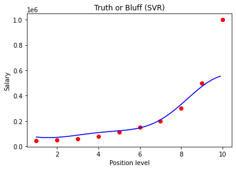

# ML_support_vector_regression_model

This script displays the results of a support vector Regression_model applied to data that includes position level and salary information. I trained the SVR model on the whole dataset with Gaussian (radial basis function) kernel because we only have a little amount of data.Test store was calculated. The methods of feature scaling and inverse transformation were used. I plotted the regression model in two resolutions: low and high.

## Install Requirements

```bash
$ pip install -r requirement.txt
```

